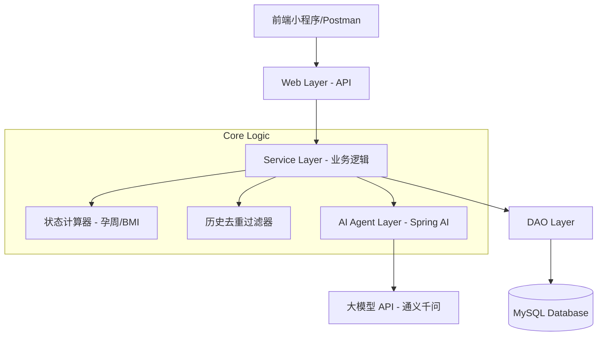

# 孕妇今天吃啥 (Pregnancy Meal Assistant)


> 🍽️ 基于 AI 的智能孕期饮食推荐助手，为准妈妈提供个性化、科学的营养食谱建议。

---

## ✨ 功能特性

- 🤖 **AI 智能推荐** - 基于阿里云 DashScope 大模型，根据孕周、BMI 和饮食偏好生成个性化食谱
- 📊 **孕期状态管理** - 自动计算孕周、BMI 指数，提供孕期阶段建议
- 🔄 **流式响应** - 支持 SSE 流式接口，实时推送 AI 生成内容
- 📝 **历史去重** - 智能避免重复推荐，确保饮食多样性
- 🔐 **微信登录** - 支持微信小程序静默登录和 JWT 鉴权
- 📈 **体重追踪** - 记录孕期体重变化，生成趋势分析
- 💬 **每日鼓励** - AI 生成个性化鼓励语录，陪伴孕期每一天
- 🛡️ **AI 日志监控** - 完整记录 AI 请求响应，支持性能分析

---

## 🛠️ 技术栈

| 分类 | 技术 | 版本 |
|------|------|------|
| **语言** | Java | 21 |
| **框架** | Spring Boot | 3.3.5 |
| **AI 框架** | Spring AI Alibaba | 1.1.0-RC2 |
| **数据库** | MySQL | 8.0 |
| **ORM** | Spring Data JPA | - |
| **认证** | JWT (jjwt) | 0.12.5 |
| **微信SDK** | weixin-java-miniapp | 4.8.0 |
| **API 文档** | SpringDoc OpenAPI | 2.6.0 |
| **工具库** | Lombok | 1.18.30 |

---

## 📐 系统架构



### 核心模块

| 模块 | 职责 |
|------|------|
| **User Context Engine** | 计算孕周、孕期阶段、BMI 指数、饮食策略 |
| **Recommendation Engine** | 查缓存 → 去重 → 调 AI → 存库 的推荐闭环 |
| **Data Layer** | 用户档案、食谱库、浏览记录的 CRUD |

---

## 🚀 快速开始

### 环境要求

- **JDK**: 21+
- **Maven**: 3.8+
- **MySQL**: 8.0+
- **Docker** (可选): 20.10+

### 1. 克隆项目

```bash
git clone https://github.com/your-username/pregnancy-meal-assistant.git
cd pregnancy-meal-assistant
```

### 2. 配置环境变量

```bash
# 复制环境变量模板
cp .env.example .env

# 编辑配置（必填项）
vim .env
```

**必填配置项：**

```properties
# MySQL 数据库
DB_URL=jdbc:mysql://localhost:3306/pregnancy_meal?useUnicode=true&characterEncoding=utf-8&useSSL=false&serverTimezone=Asia/Shanghai
DB_USERNAME=root
DB_PASSWORD=your_password

# 阿里云 DashScope API Key
ALI_AI_KEY=your_dashscope_api_key

# 微信小程序
WX_MINIAPP_APPID=your_appid
WX_MINIAPP_SECRET=your_secret

# JWT 密钥（至少32字符）
JWT_SECRET=your_very_long_secret_key_at_least_32_chars
```

### 3. 初始化数据库

```bash
# 连接 MySQL 执行初始化脚本
mysql -u root -p < src/main/resources/schema.sql
```

### 4. 启动应用

**方式一：Maven 启动**

```bash
./mvnw spring-boot:run
```

**方式二：Docker Compose 启动**

```bash
docker compose up -d --build
```

> 📖 详细部署指南请参考 [DEPLOYMENT.md](DEPLOYMENT.md)

### 5. 验证启动

```bash
# 访问 API 文档
curl http://localhost:8080/api/v3/api-docs

# 或打开浏览器访问 Swagger UI
open http://localhost:8080/api/swagger-ui.html
```

---

## 📖 API 文档概览

### 核心接口

| 方法 | 路径 | 描述 |
|------|------|------|
| `POST` | `/api/v1/user/profile` | 用户档案初始化/更新 |
| `GET` | `/api/v1/user/status` | 获取今日状态（孕周、BMI等） |
| `GET` | `/api/v1/meal/recommend` | 智能食谱推荐 |
| `GET` | `/api/v1/meal/recommend/stream` | 流式食谱推荐（SSE） |
| `GET` | `/api/v1/meal/history` | 获取浏览历史 |
| `POST` | `/api/v1/feedback` | 提交用户反馈 |

### 辅助接口

| 方法 | 路径 | 描述 |
|------|------|------|
| `GET` | `/api/v1/encouragement/today` | 获取今日鼓励语录 |
| `POST` | `/api/v1/weight/record` | 记录体重 |
| `GET` | `/api/v1/weight/stats` | 体重统计分析 |
| `GET` | `/api/v1/ai-log/recent` | 查询最近 AI 日志 |
| `GET` | `/api/v1/ai-log/stats/performance` | AI 性能统计 |

> 📖 完整 API 文档请访问 `/api/swagger-ui.html`

---

## 📁 项目结构

```
com.hjkj.pregnancy
├── config              # 配置类 (Spring AI, Swagger, Web)
├── controller          # 接口层 (REST Controllers)
├── entity              # 数据库实体 (JPA Entities)
├── repository          # DAO 层 (JPA Repositories)
├── service             # 业务接口与实现
│   └── impl            # 业务实现类
├── model               # 数据模型
│   ├── dto             # 请求对象
│   ├── vo              # 响应对象
│   └── ai              # AI 映射 Record
├── interceptor         # 拦截器 (JWT, AI Log)
├── exception           # 异常处理
├── validation          # 自定义校验器
├── cache               # 缓存管理
├── enums               # 枚举类型
└── utils               # 工具类
```

---

## 📚 相关文档

| 文档 | 描述 |
|------|------|
| [DEPLOYMENT.md](DEPLOYMENT.md) | Docker 部署完整指南 |
| [.env.example](.env.example) | 环境变量配置模板 |
| [schema.sql](src/main/resources/schema.sql) | 数据库初始化脚本 |

---

## 🗄️ 数据库设计

### 核心表结构

| 表名 | 描述 |
|------|------|
| `user_profile` | 用户档案（孕周、BMI、偏好等） |
| `recipe` | 智能食谱缓存池 |
| `user_history` | 用户浏览历史 |
| `user_feedback` | 用户反馈（喜欢/不喜欢/吃腻了） |
| `daily_encouragement` | 每日鼓励语录 |
| `daily_recommendation` | 每日推荐缓存 |
| `weight_record` | 体重记录 |
| `ai_request_log` | AI 请求日志 |

---

## 🤝 贡献指南

1. Fork 本仓库
2. 创建特性分支 (`git checkout -b feature/AmazingFeature`)
3. 提交更改 (`git commit -m 'Add some AmazingFeature'`)
4. 推送到分支 (`git push origin feature/AmazingFeature`)
5. 创建 Pull Request

---

## 📄 许可证

本项目采用 [MIT License](LICENSE) 开源协议。

---

## 👨‍💻 作者

**Zhibin Jiang**

---

<p align="center">
  Made with ❤️ for all expecting mothers
</p>
